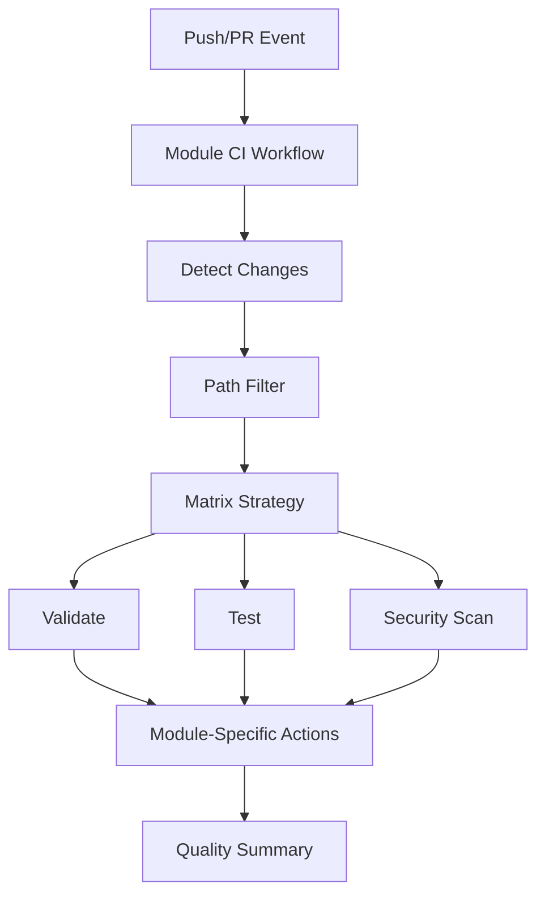
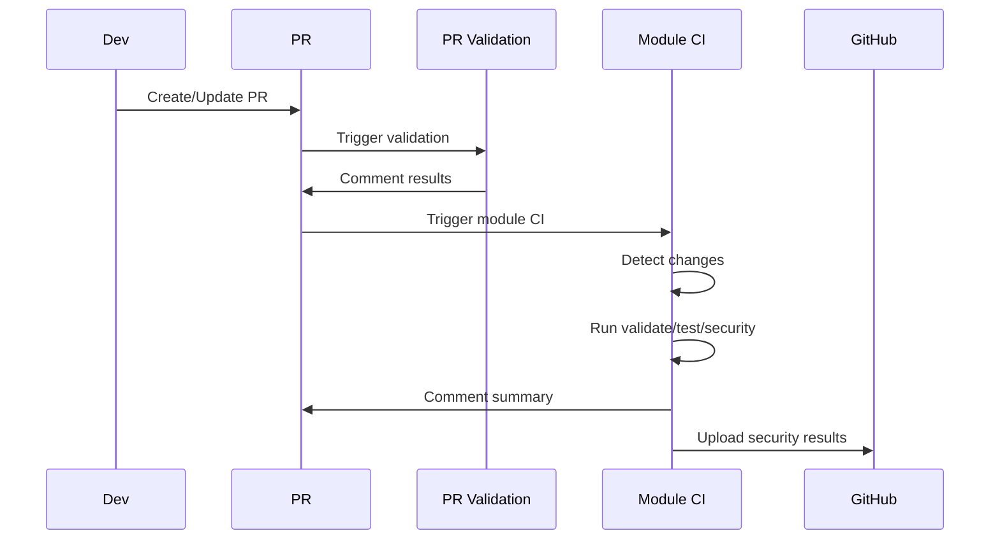
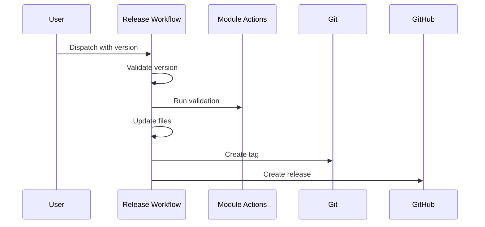

# GitHub Actions Workflows Documentation

This document provides a comprehensive overview of all GitHub Actions workflows in the Azure Terraform Modules repository, their architecture, and how they work together.

## Table of Contents

1. [Architecture Overview](#architecture-overview)
2. [Directory Structure](#directory-structure)
3. [Core Workflows](#core-workflows)
4. [Shared Actions](#shared-actions)
5. [Module-Specific Actions](#module-specific-actions)
6. [Workflow Interactions](#workflow-interactions)
7. [Adding New Modules](#adding-new-modules)
8. [Troubleshooting](#troubleshooting)

## Architecture Overview

The workflow architecture follows a **monorepo pattern** with dynamic module discovery:



### Key Principles

1. **Dynamic Discovery**: Workflows automatically detect which modules have changed
2. **Parallel Execution**: Multiple modules are processed concurrently
3. **Module Isolation**: Each module has its own composite actions
4. **Reusability**: Shared actions for common tasks
5. **Scalability**: Easy to add new modules without modifying core workflows

## Directory Structure

```
azurerm-terraform-modules/
├── .github/
│   ├── workflows/                    # Root workflows (must be here for GitHub)
│   │   ├── module-ci.yml            # Main CI dispatcher
│   │   ├── module-release.yml       # Release workflow
│   │   ├── module-docs.yml          # Documentation automation
│   │   ├── pr-validation.yml        # PR quality checks
│   │   └── repo-maintenance.yml     # Scheduled maintenance
│   └── actions/                     # Shared composite actions
│       ├── detect-modules/          # Module detection logic
│       └── terraform-setup/         # Terraform environment setup
└── modules/
    └── <module_name>/
        └── .github/
            ├── actions/             # Module-specific composite actions
            │   ├── validate/        # Validation logic
            │   ├── test/           # Testing logic
            │   ├── security/       # Security scanning
            │   └── release/        # Release preparation
            └── module-config.yml    # Module metadata
```

## Core Workflows

### 1. Module CI (`module-ci.yml`)

**Purpose**: Main CI/CD dispatcher that orchestrates validation, testing, and security scanning for changed modules.

**Triggers**:
- Pull requests that modify files in `modules/**` or `shared/**`
- Pushes to `main` or `release/**` branches

**Jobs**:

#### `detect-changes`
```yaml
- Uses: dorny/paths-filter to detect which modules changed
- Creates a matrix of modules for parallel processing
- Outputs: 
  - modules: Array of changed module names
  - matrix: JSON matrix for strategy
```

#### `validate`
```yaml
- Runs for each changed module in parallel
- Executes module-specific validation composite action
- Checks:
  - Terraform formatting (terraform fmt)
  - Terraform initialization (terraform init)
  - Terraform validation (terraform validate)
  - TFLint analysis
  - Example validation
```

#### `test`
```yaml
- Runs after validation passes
- Executes module-specific test composite action
- Performs:
  - Unit tests with Go
  - Integration tests with Terratest
  - Example deployment tests
- Uses OIDC for Azure authentication
```

#### `security-scan`
```yaml
- Runs in parallel with tests
- Executes module-specific security composite action
- Tools:
  - Checkov for Terraform security
  - Trivy for infrastructure scanning
  - Custom security checks
- Uploads results to GitHub Security tab
```

#### `quality-summary`
```yaml
- Runs after all checks complete
- Creates/updates PR comment with results
- Shows pass/fail status for each check
```

### 2. Module Release (`module-release.yml`)

**Purpose**: Manages semantic versioning and releases for individual modules.

**Triggers**:
- Manual workflow dispatch with inputs:
  - `module`: Module to release (dropdown)
  - `version`: Semantic version (e.g., 1.2.0)
  - `release_notes`: Optional release notes

**Jobs**:

#### `validate-version`
```yaml
- Validates semantic version format
- Checks if version already exists
- Generates tag name: <module>/v<version>
```

#### `release`
```yaml
- Runs final validation
- Updates module-config.yml with new version
- Updates CHANGELOG.md
- Regenerates documentation
- Creates git tag and GitHub release
- Includes installation instructions in release
```

### 3. Module Documentation (`module-docs.yml`)

**Purpose**: Automatically generates and updates Terraform documentation.

**Triggers**:
- Push to main with changes to `*.tf` files
- Manual workflow dispatch (optional module filter)

**Jobs**:

#### `detect-modules`
```yaml
- Finds all modules or specific module
- Creates matrix for parallel processing
```

#### `update-docs`
```yaml
- Uses terraform-docs to generate README
- Creates PR if documentation changed
- Labels: documentation, automated, module:<name>
```

### 4. PR Validation (`pr-validation.yml`)

**Purpose**: Enforces code quality standards across all PRs.

**Triggers**:
- Pull request events (opened, synchronize, reopened, edited)

**Jobs**:

#### `validate-pr-title`
```yaml
- Checks conventional commit format
- Allowed types: feat, fix, docs, style, refactor, perf, test, build, ci, chore, revert
- Allowed scopes: Module names and core components
```

#### `validate-commits`
```yaml
- Validates all commit messages
- Enforces conventional commit format
- Provides clear error messages
```

#### `terraform-fmt`
```yaml
- Checks Terraform formatting
- Comments on PR with fix instructions
```

#### `terraform-validate`
```yaml
- Basic validation for all modules
- Runs terraform init and validate
```

#### `tflint`
```yaml
- Runs TFLint on all modules
- Comments detailed issues on PR
```

#### `documentation-check`
```yaml
- Verifies documentation is up-to-date
- Comments with update instructions
```

#### `security-scan`
```yaml
- Quick security scan with Checkov
- Reports summary of findings
```

### 5. Repository Maintenance (`repo-maintenance.yml`)

**Purpose**: Automated maintenance tasks for repository health.

**Triggers**:
- Weekly schedule (Mondays at 2 AM)
- Manual workflow dispatch

**Jobs**:

#### `update-dependencies`
```yaml
- Checks for Terraform provider updates
- Integrates with Dependabot
```

#### `module-inventory`
```yaml
- Generates MODULES.md with all modules
- Includes version, description, test status
- Creates PR with updates
```

#### `security-audit`
```yaml
- Comprehensive security scan of all modules
- Generates security report
```

#### `cleanup`
```yaml
- Closes stale issues and PRs
- Configurable stale periods
- Exempts security-related items
```

## Shared Actions

### 1. Detect Modules (`detect-modules/action.yml`)

**Purpose**: Automatically discovers Terraform modules in the repository.

**Outputs**:
- `modules`: JSON array of module names
- `filters`: Path filters for dorny/paths-filter

**Logic**:
```bash
# Find all main.tf files
find modules -name "main.tf" -type f
# Extract module names
# Generate JSON array and path filters
```

### 2. Terraform Setup (`terraform-setup/action.yml`)

**Purpose**: Standardized Terraform environment setup with caching.

**Inputs**:
- `terraform-version`: Version to install (default: 1.10.3)
- `install-tflint`: Whether to install TFLint
- `install-terraform-docs`: Whether to install terraform-docs

**Features**:
- Terraform installation via hashicorp/setup-terraform
- Provider plugin caching
- Optional tool installation

## Module-Specific Actions

Each module contains four composite actions in `.github/actions/`:

### 1. Validate (`validate/action.yml`)

**Purpose**: Module-specific validation logic.

**Steps**:
1. Terraform format check
2. Terraform init (no backend)
3. Terraform validate
4. TFLint analysis
5. Example validation

### 2. Test (`test/action.yml`)

**Purpose**: Module-specific testing logic.

**Steps**:
1. Go environment setup
2. Terraform setup
3. Go module caching
4. Unit test execution
5. Integration test execution
6. Example testing

### 3. Security (`security/action.yml`)

**Purpose**: Module-specific security scanning.

**Steps**:
1. Checkov scanning
2. Trivy scanning
3. SARIF result upload
4. Custom security checks (hardcoded secrets, secure defaults)

### 4. Release (`release/action.yml`)

**Purpose**: Module-specific release preparation.

**Steps**:
1. Pre-release validation
2. Documentation verification
3. CHANGELOG check
4. Release artifact creation
5. Module registry update

## Workflow Interactions

### PR Flow



### Release Flow



## Adding New Modules

### Step 1: Create Module Structure

```bash
# Create module directory
mkdir -p modules/azurerm_virtual_network

# Copy action structure from existing module
cp -r modules/azurerm_storage_account/.github modules/azurerm_virtual_network/

# Create Terraform files
touch modules/azurerm_virtual_network/{main,variables,outputs,versions}.tf
```

### Step 2: Update Module Configuration

Edit `modules/azurerm_virtual_network/.github/module-config.yml`:

```yaml
name: azurerm_virtual_network
description: "Azure Virtual Network Terraform module"
version: 0.1.0
terraform:
  required_version: ">= 1.5.0"
  required_providers:
    azurerm: ">= 3.0.0"
```

### Step 3: Update Workflow Filters

Edit `.github/workflows/module-ci.yml`:

```yaml
filters: |
  azurerm_storage_account:
    - 'modules/azurerm_storage_account/**'
    - 'shared/**'
  azurerm_virtual_network:    # Add new module
    - 'modules/azurerm_virtual_network/**'
    - 'shared/**'
```

### Step 4: Update Release Options

Edit `.github/workflows/module-release.yml`:

```yaml
options:
  - azurerm_storage_account
  - azurerm_virtual_network  # Add new module
```

### Step 5: Customize Module Actions

Update the composite actions in `modules/azurerm_virtual_network/.github/actions/` to match module-specific requirements.

## Troubleshooting

### Common Issues

1. **Module not detected**
   - Check if `main.tf` exists in the module directory
   - Verify path filters in `module-ci.yml`

2. **Composite action not found**
   - Ensure `action.yml` exists in the action directory
   - Check the path in the workflow matches the actual location

3. **Tests failing with authentication**
   - Verify OIDC is configured correctly
   - Check Azure credentials in repository secrets

4. **Documentation not updating**
   - Ensure terraform-docs is installed
   - Check if README.md has proper injection markers

### Debug Mode

Enable debug logging:
```yaml
env:
  ACTIONS_RUNNER_DEBUG: true
  ACTIONS_STEP_DEBUG: true
```

### Performance Optimization

1. **Use caching**:
   - Terraform provider cache
   - Go module cache
   - Pre-commit cache

2. **Parallel execution**:
   - Matrix strategy for multiple modules
   - Concurrent job execution

3. **Conditional execution**:
   - Skip unchanged modules
   - Run heavy tests only on main branch

## Best Practices

1. **Module Independence**: Each module should be self-contained with its own tests and documentation
2. **Semantic Versioning**: Follow semver for module releases
3. **Security First**: Always include security scanning in CI/CD
4. **Documentation**: Keep README.md updated with terraform-docs
5. **Testing**: Write comprehensive tests for all modules
6. **Conventional Commits**: Use for clear change history

## References

- [GitHub Actions Documentation](https://docs.github.com/en/actions)
- [Composite Actions Guide](https://docs.github.com/en/actions/creating-actions/creating-a-composite-action)
- [Terraform Documentation](https://www.terraform.io/docs)
- [terraform-docs](https://terraform-docs.io/)
- [TFLint](https://github.com/terraform-linters/tflint)
- [Checkov](https://www.checkov.io/)
- [Terratest](https://terratest.gruntwork.io/)