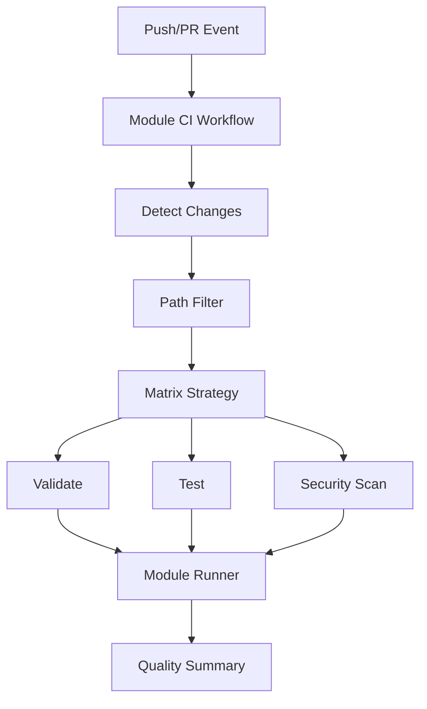
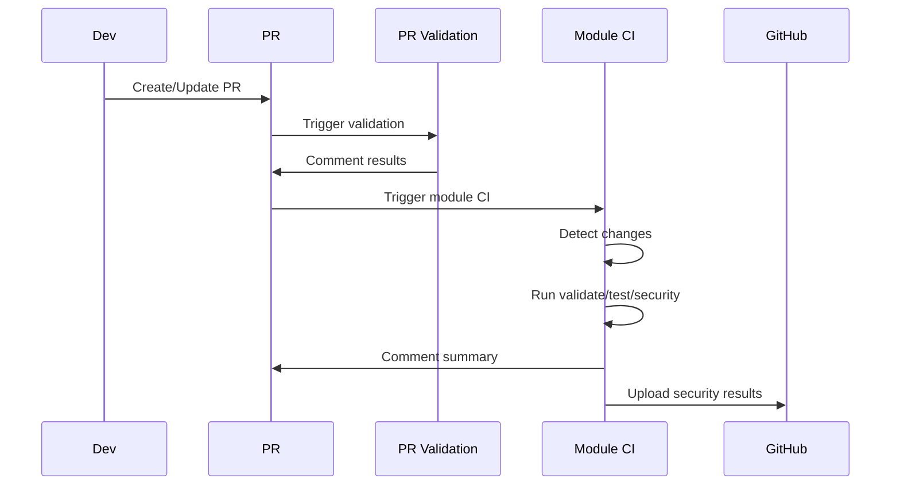
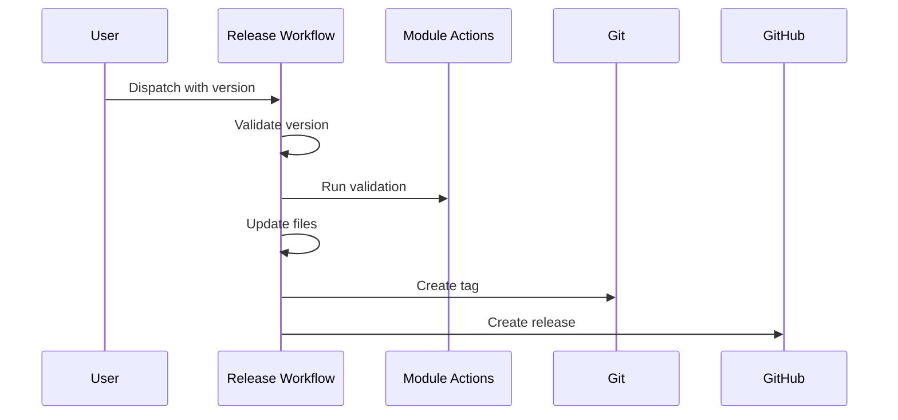

# GitHub Actions Workflows Documentation

This document provides a comprehensive overview of all GitHub Actions workflows in the Azure Terraform Modules repository, their architecture, and how they work together.

## Table of Contents

1. [Architecture Overview](#architecture-overview)
2. [Directory Structure](#directory-structure)
3. [Core Workflows](#core-workflows)
4. [Shared Actions](#shared-actions)
5. [Module-Specific Actions](#module-specific-actions)
6. [Workflow Interactions](#workflow-interactions)
7. [Adding New Modules](#adding-new-modules)
8. [Troubleshooting](#troubleshooting)

## Architecture Overview

The workflow architecture follows a **monorepo pattern** with dynamic module discovery:



### Key Principles

1. **Dynamic Discovery**: Workflows automatically detect which modules have changed
2. **Parallel Execution**: Multiple modules are processed concurrently
3. **Universal Actions**: All modules use the same standardized actions via module-runner
4. **Reusability**: Shared actions for common tasks
5. **Scalability**: Easy to add new modules without modifying core workflows

## Directory Structure

```
azurerm-terraform-modules/
├── .github/
│   ├── workflows/                    # Root workflows (must be here for GitHub)
│   │   ├── module-ci.yml            # Main CI dispatcher
│   │   ├── module-release.yml       # Release workflow
│   │   ├── module-docs.yml          # Documentation automation
│   │   ├── pr-validation.yml        # PR quality checks
│   │   └── repo-maintenance.yml     # Scheduled maintenance
│   └── actions/                     # Shared composite actions
│       ├── module-runner/           # Universal module action runner
│       │   ├── action.yml          # Main composite action
│       │   └── run-module-action.sh # Script that executes module actions
│       └── terraform-setup/         # Terraform environment setup
└── modules/
    └── <module_name>/
        └── .github/
            └── module-config.yml    # Module metadata
```

## Core Workflows

### 1. Module CI (`module-ci.yml`)

**Purpose**: Main CI/CD dispatcher that orchestrates validation, testing, and security scanning for changed modules.

**Triggers**:
- Pull requests that modify files in `modules/**` or `shared/**`
- Pushes to `main` or `release/**` branches

**Jobs**:

#### `detect-changes`
```yaml
- Uses: dorny/paths-filter to detect which modules changed
- Creates a matrix of modules for parallel processing
- Outputs: 
  - modules: Array of changed module names
  - matrix: JSON matrix for strategy
```

#### `validate`
```yaml
- Runs for each changed module in parallel
- Executes validation via module-runner action
- Checks:
  - Terraform formatting (terraform fmt)
  - Terraform initialization (terraform init)
  - Terraform validation (terraform validate)
  - TFLint analysis
  - Example validation
```

#### `test`
```yaml
- Runs after validation passes
- Executes tests via module-runner action
- Performs:
  - Unit tests with Go
  - Integration tests with Terratest
  - Example deployment tests
- Uses OIDC for Azure authentication
```

#### `security-scan`
```yaml
- Runs in parallel with tests
- Executes security scans via module-runner action
- Tools:
  - Checkov for Terraform security
  - Trivy for infrastructure scanning
  - Custom security checks
- Uploads results to GitHub Security tab
```

#### `quality-summary`
```yaml
- Runs after all checks complete
- Creates/updates PR comment with results
- Shows pass/fail status for each check
```

### 2. Module Release (`module-release.yml`)

**Purpose**: Automated semantic versioning and releases using semantic-release.

**Triggers**:
- Manual workflow dispatch with inputs:
  - `module`: Module to release (dropdown)
  - `dry_run`: Optional dry run mode (boolean)

**Jobs**:

#### `semantic-release`
```yaml
- Sets up Node.js environment
- Installs semantic-release dependencies
- Validates module with Terraform
- Runs semantic-release which automatically:
  - Analyzes commits since last release
  - Determines version bump (major/minor/patch)
  - Updates CHANGELOG.md following Keep a Changelog
  - Updates module-config.yml version
  - Creates git tag with module prefix (e.g., SAv1.2.3)
  - Commits changes
  - Creates GitHub release with notes
- Updates documentation with terraform-docs if needed
```

**Key Features**:
- Zero manual version decisions
- Automatic CHANGELOG generation
- Conventional commit enforcement
- Module-specific versioning
- Dry run capability for testing

### 3. Module Documentation (`module-docs.yml`)

**Purpose**: Automatically generates and updates Terraform documentation.

**Triggers**:
- Push to main with changes to `*.tf` files
- Manual workflow dispatch (optional module filter)

**Jobs**:

#### `detect-modules`
```yaml
- Finds all modules or specific module
- Creates matrix for parallel processing
```

#### `update-docs`
```yaml
- Uses terraform-docs to generate README
- Creates PR if documentation changed
- Labels: documentation, automated, module:<name>
```

### 4. PR Validation (`pr-validation.yml`)

**Purpose**: Enforces code quality standards across all PRs.

**Triggers**:
- Pull request events (opened, synchronize, reopened, edited)

**Jobs**:

#### `validate-pr-title`
```yaml
- Checks conventional commit format
- Allowed types: feat, fix, docs, style, refactor, perf, test, build, ci, chore, revert
- Allowed scopes: Module names and core components
```

#### `validate-commits`
```yaml
- Validates all commit messages
- Enforces conventional commit format
- Provides clear error messages
```

#### `terraform-fmt`
```yaml
- Checks Terraform formatting
- Comments on PR with fix instructions
```

#### `terraform-validate`
```yaml
- Basic validation for all modules
- Runs terraform init and validate
```

#### `tflint`
```yaml
- Runs TFLint on all modules
- Comments detailed issues on PR
```

#### `documentation-check`
```yaml
- Verifies documentation is up-to-date
- Comments with update instructions
```

#### `security-scan`
```yaml
- Quick security scan with Checkov
- Reports summary of findings
```

### 5. Repository Maintenance (`repo-maintenance.yml`)

**Purpose**: Automated maintenance tasks for repository health.

**Triggers**:
- Weekly schedule (Mondays at 2 AM)
- Manual workflow dispatch

**Jobs**:

#### `update-dependencies`
```yaml
- Checks for Terraform provider updates
- Integrates with Dependabot
```

#### `module-inventory`
```yaml
- Generates MODULES.md with all modules
- Includes version, description, test status
- Creates PR with updates
```

#### `security-audit`
```yaml
- Comprehensive security scan of all modules
- Generates security report
```

#### `cleanup`
```yaml
- Closes stale issues and PRs
- Configurable stale periods
- Exempts security-related items
```

## Shared Actions

### 1. Detect Modules (`detect-modules/action.yml`)

**Purpose**: Automatically discovers Terraform modules in the repository.

**Outputs**:
- `modules`: JSON array of module names
- `filters`: Path filters for dorny/paths-filter

**Logic**:
```bash
# Find all main.tf files
find modules -name "main.tf" -type f
# Extract module names
# Generate JSON array and path filters
```

### 2. Terraform Setup (`terraform-setup/action.yml`)

**Purpose**: Standardized Terraform environment setup with caching.

**Inputs**:
- `terraform-version`: Version to install (default: 1.10.3)
- `install-tflint`: Whether to install TFLint
- `install-terraform-docs`: Whether to install terraform-docs

**Features**:
- Terraform installation via hashicorp/setup-terraform
- Provider plugin caching
- Optional tool installation

## Module Runner Action

The `module-runner` action is a universal composite action that executes standardized workflows for all modules.

### Architecture

```
.github/actions/module-runner/
├── action.yml              # Composite action definition
└── run-module-action.sh    # Bash script with action logic
```

### How It Works

1. **Dynamic Execution**: The module-runner receives the module name and action type as inputs
2. **Script-Based Logic**: Uses a bash script to work around GitHub Actions limitations with dynamic `uses`
3. **Standardized Workflows**: All modules follow the same validation, test, and security patterns

### Supported Actions

#### 1. Validate

**Purpose**: Standardized validation for all Terraform modules.

**Steps**:
1. Terraform format check (`terraform fmt -check -recursive`)
2. Terraform init without backend (`terraform init -backend=false`)
3. Terraform validate (`terraform validate`)
4. TFLint installation and analysis
5. Example validation (validates all examples in `examples/*/`)

#### 2. Test

**Purpose**: Standardized testing for all Terraform modules.

**Steps**:
1. Azure credentials setup (supports both OIDC and client secret)
2. Go environment detection
3. Go module download if `go.mod` exists
4. Test execution with `go test -v -timeout 30m`
5. Fallback warning if no tests found

#### 3. Security

**Purpose**: Standardized security scanning for all Terraform modules.

**Steps**:
1. tfsec scanning with SARIF output
2. Checkov scanning with SARIF output
3. SARIF file upload to GitHub Security tab
4. Soft-fail mode to allow reporting without blocking

### Environment Variables

The module-runner handles Azure authentication by setting both `AZURE_*` and `ARM_*` environment variables:

```bash
# For OIDC authentication
ARM_USE_OIDC=true
ARM_CLIENT_ID
ARM_TENANT_ID
ARM_SUBSCRIPTION_ID

# For client secret authentication (when needed)
ARM_CLIENT_SECRET
```

## Workflow Interactions

### PR Flow



### Release Flow



## Adding New Modules

### Step 1: Create Module Structure

```bash
# Create module directory
mkdir -p modules/azurerm_virtual_network

# Create .github directory for module configuration
mkdir -p modules/azurerm_virtual_network/.github

# Copy module configuration from existing module
cp modules/azurerm_storage_account/.github/module-config.yml modules/azurerm_virtual_network/.github/

# Create Terraform files
touch modules/azurerm_virtual_network/{main,variables,outputs,versions}.tf
```

### Step 2: Update Module Configuration

Edit `modules/azurerm_virtual_network/.github/module-config.yml`:

```yaml
name: azurerm_virtual_network
description: "Azure Virtual Network Terraform module"
version: 0.1.0
terraform:
  required_version: ">= 1.5.0"
  required_providers:
    azurerm: ">= 3.0.0"
```

### Step 3: Update Workflow Filters

Edit `.github/workflows/module-ci.yml`:

```yaml
filters: |
  azurerm_storage_account:
    - 'modules/azurerm_storage_account/**'
    - 'shared/**'
  azurerm_virtual_network:    # Add new module
    - 'modules/azurerm_virtual_network/**'
    - 'shared/**'
```

### Step 4: Release Workflow

The module-release workflow accepts any module name as a string input, so no changes are needed to the workflow when adding new modules. Simply use:

```bash
# Trigger release via GitHub UI or API
# Input: module = "azurerm_virtual_network"
```

### Step 5: Module Testing

The module will automatically use the standardized module-runner action for:
- Validation (Terraform format, init, validate, TFLint)
- Testing (Go tests if present in `tests/` directory)
- Security scanning (tfsec and Checkov)

No additional configuration needed!

## Troubleshooting

### Common Issues

1. **Module not detected**
   - Check if `main.tf` exists in the module directory
   - Verify path filters in `module-ci.yml`

2. **Composite action not found**
   - Ensure `action.yml` exists in the action directory
   - Check the path in the workflow matches the actual location

3. **Tests failing with authentication**
   - Verify OIDC is configured correctly
   - Check Azure credentials in repository secrets

4. **Documentation not updating**
   - Ensure terraform-docs is installed
   - Check if README.md has proper injection markers

### Debug Mode

Enable debug logging:
```yaml
env:
  ACTIONS_RUNNER_DEBUG: true
  ACTIONS_STEP_DEBUG: true
```

### Performance Optimization

1. **Use caching**:
   - Terraform provider cache
   - Go module cache
   - Pre-commit cache

2. **Parallel execution**:
   - Matrix strategy for multiple modules
   - Concurrent job execution

3. **Conditional execution**:
   - Skip unchanged modules
   - Run heavy tests only on main branch

## Best Practices

1. **Module Independence**: Each module should be self-contained with its own tests and documentation
2. **Automated Versioning**: Use semantic-release for automatic version management
3. **Security First**: Always include security scanning in CI/CD
4. **Documentation**: Keep README.md updated with terraform-docs
5. **Testing**: Write comprehensive tests for all modules
6. **Conventional Commits**: Required for semantic-release automation

## Semantic Release Configuration

### Overview
This repository uses [semantic-release](https://semantic-release.gitbook.io/) for fully automated version management and CHANGELOG generation.

### Module Configuration
Each module requires a `.releaserc.js` file:

```javascript
module.exports = {
  branches: ['main'],
  tagFormat: 'SAv${version}',  // Module-specific prefix
  plugins: [
    '@semantic-release/commit-analyzer',
    '@semantic-release/release-notes-generator',
    '@semantic-release/changelog',
    '@semantic-release/git',
    '@semantic-release/github'
  ]
};
```

### Commit Message Format
Commits MUST follow conventional format with module scope:

```bash
feat(storage-account): add new encryption feature
fix(storage-account): resolve validation bug

BREAKING CHANGE: renamed variable 'enable_logs' to 'diagnostic_settings'
```

### Version Determination
- `feat:` commits trigger minor version bump (1.0.0 → 1.1.0)
- `fix:` commits trigger patch version bump (1.0.0 → 1.0.1)
- `BREAKING CHANGE:` triggers major version bump (1.0.0 → 2.0.0)

### Release Process
1. Merge PR with conventional commits to main
2. Manually trigger module-release workflow
3. Semantic-release automatically:
   - Analyzes commits
   - Determines version
   - Updates CHANGELOG.md
   - Creates git tag
   - Publishes GitHub release

## References

- [GitHub Actions Documentation](https://docs.github.com/en/actions)
- [Composite Actions Guide](https://docs.github.com/en/actions/creating-actions/creating-a-composite-action)
- [Semantic Release Documentation](https://semantic-release.gitbook.io/)
- [Conventional Commits](https://www.conventionalcommits.org/)
- [Terraform Documentation](https://www.terraform.io/docs)
- [terraform-docs](https://terraform-docs.io/)
- [TFLint](https://github.com/terraform-linters/tflint)
- [Checkov](https://www.checkov.io/)
- [Terratest](https://terratest.gruntwork.io/)