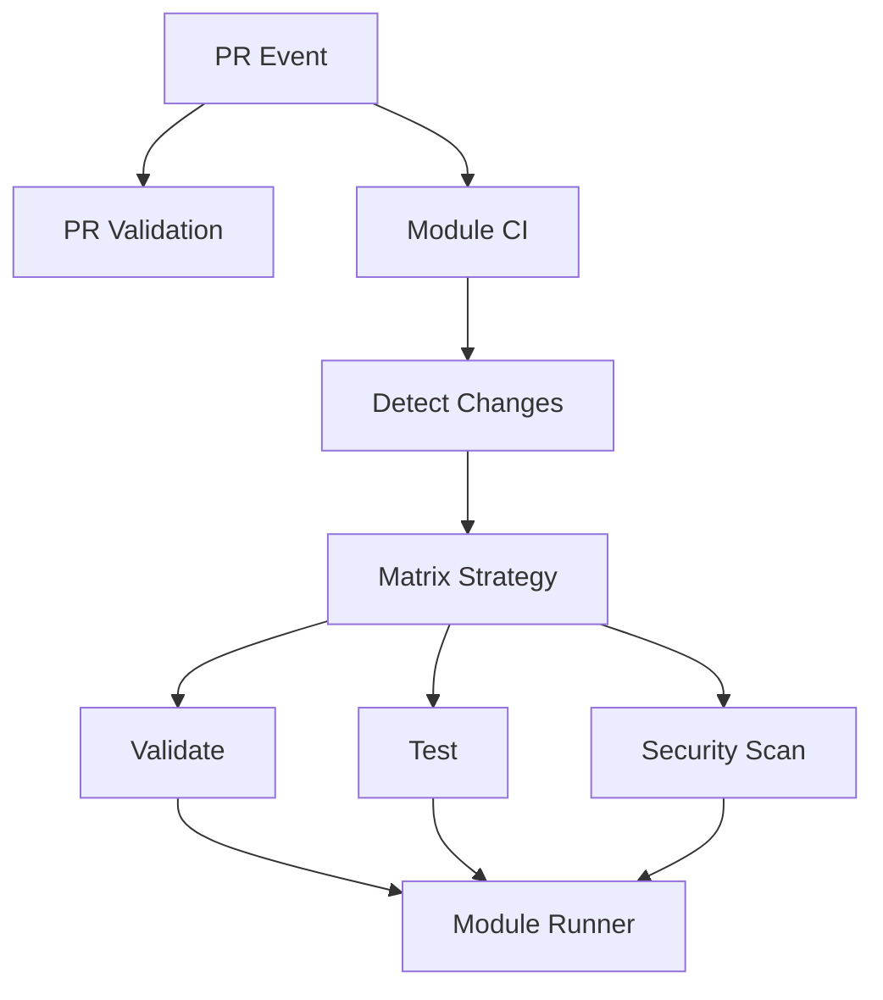
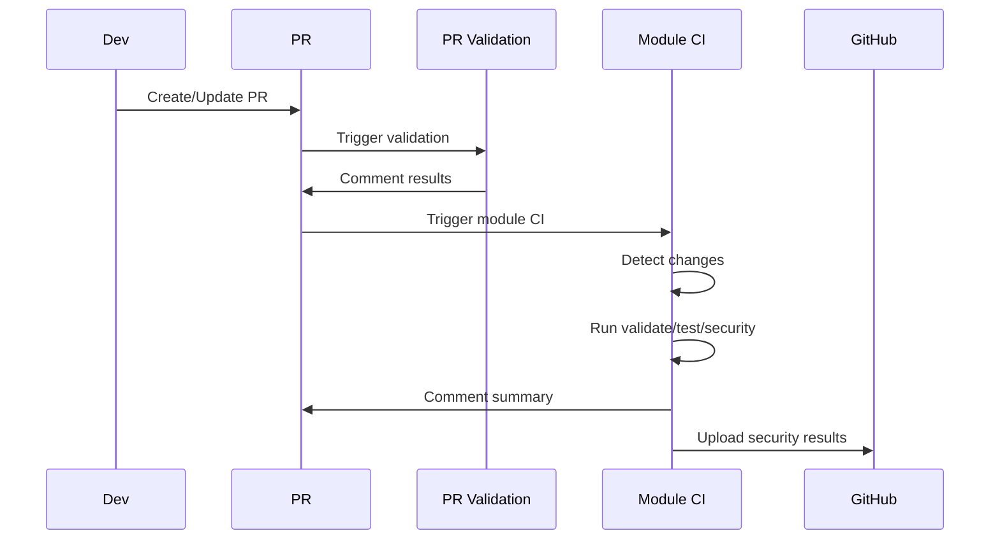
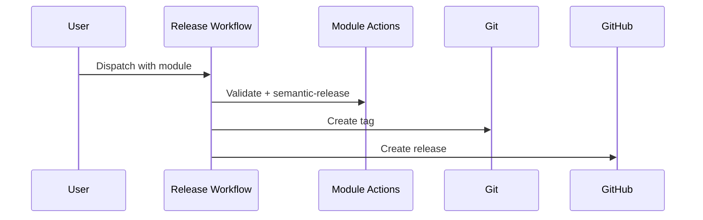

# GitHub Actions Workflows Documentation

This document provides a detailed overview of all GitHub Actions workflows in the repository, how they work, and how they interact.

## Table of Contents

1. [Architecture Overview](#architecture-overview)
2. [Directory Structure](#directory-structure)
3. [Core Workflows](#core-workflows)
4. [Workflow Script Map (Task-009 audit)](#workflow-script-map-task-009-audit)
5. [File Mutation Map (Task-009 audit)](#file-mutation-map-task-009-audit)
6. [Script Catalog (Task-009 audit)](#script-catalog-task-009-audit)
7. [Known Risks and Gaps (Task-009 audit)](#known-risks-and-gaps-task-009-audit)
8. [Shared Actions](#shared-actions)
9. [Workflow Interactions](#workflow-interactions)
10. [Adding New Modules](#adding-new-modules)
11. [Troubleshooting](#troubleshooting)
12. [Best Practices](#best-practices)
13. [Semantic Release Configuration](#semantic-release-configuration)
14. [References](#references)

## Architecture Overview

The workflow architecture follows a **monorepo pattern** with dynamic module discovery and per-module parallel execution.



### Key Principles

1. **Dynamic Discovery**: Workflows detect which modules changed.
2. **Parallel Execution**: Multiple modules are processed concurrently.
3. **Standardized Actions**: Shared module-runner handles common logic.
4. **Scalability**: New modules require no workflow changes.

## Directory Structure

```
azurerm-terraform-modules/
├── .github/
│   ├── workflows/
│   │   ├── module-ci.yml               # Main module CI dispatcher
│   │   ├── pr-validation.yml           # PR quality checks
│   │   ├── module-release.yml          # Release single module
│   │   ├── release-changed-modules.yml # Release modules after merge
│   │   └── list-modules.yml            # List all modules + metadata
│   └── actions/
│       ├── module-runner/              # Run validate/test/security per module
│       ├── terraform-setup/            # Terraform + tooling setup
│       └── detect-modules/             # Helper for module discovery
└── modules/
    └── <module_name>/
        └── module.json                 # Module metadata
```

## Core Workflows

### 1. Module CI (`module-ci.yml`)

**Purpose**: Main CI dispatcher for module validation, testing, and security scans.

**Triggers**:
- `pull_request` (paths: `modules/**`, `shared/**`, `.github/workflows/module-ci.yml`, `.github/actions/**`)
- `workflow_dispatch` with inputs:
  - `test_type`: `short`, `full`, `integration-only` (currently accepted but not used in jobs)
  - `module`: optional module name to scope execution

**Jobs**:

#### `detect-changes`
- Parses PR title scopes (e.g., `feat(azurerm_virtual_network): ...`) for module names.
- Generates dynamic `paths-filter` based on current module list.
- Merges PR-title detection and path detection.
- For workflow_dispatch with `module` input, uses that module directly.
- Outputs:
  - `modules` (JSON array)
  - `matrix` (JSON matrix)

#### `validate` (matrix)
- Uses `.github/actions/terraform-setup` with TFLint enabled.
- Runs `.github/actions/module-runner` with `action=validate`.
- Validates module and examples (`terraform fmt`, `init -backend=false`, `validate`, `tflint`).

#### `test` (matrix)
- Logs in to Azure via OIDC (`azure/login@v2`).
- Runs `.github/actions/module-runner` with `action=test`.
- Passes Azure credentials JSON for ARM/AZURE env var setup.

#### `security-scan` (matrix)
- Runs `.github/actions/module-runner` with `action=security`.
- Produces SARIF uploads for tfsec and Checkov.

#### `quality-summary`
- Runs always.
- Posts a PR comment with module-level summary (only on PR events).

**Scripts and actions used**:
- `.github/actions/terraform-setup` (Terraform install + cache, optional TFLint).
- `.github/actions/module-runner` -> `.github/actions/module-runner/run-module-action.sh`.
- `azure/login@v2` for test jobs (OIDC).

**Files written**:
- `modules/<module>/tfsec-results.sarif` and `modules/<module>/checkov-results.sarif` when `action=security`.
- No intentional repo changes for validate/test jobs (other than transient `.terraform` dirs on the runner).

### 2. PR Validation (`pr-validation.yml`)

**Purpose**: Enforces quality gates and documentation standards for PRs.

**Triggers**:
- `pull_request` events: opened, synchronize, reopened, edited

**Jobs**:

#### `detect-changes`
- Same detection strategy as Module CI.
- Outputs module matrix.

#### `validate-pr-title`
- Uses `amannn/action-semantic-pull-request@v6`.
- Enforces conventional commit style.
- Scopes include module names and core tooling scopes.

#### `terraform-fmt` (matrix)
- Runs `terraform fmt -check -recursive` across module subdirs containing `.tf`.

#### `terraform-validate` (matrix)
- Runs `terraform init -backend=false` + `terraform validate` for module root.
- Validates all examples under `examples/*/`.

#### `unit-tests` (matrix)
- Runs `terraform test` when `tests/unit` exists.

#### `tflint` (matrix)
- Uses `terraform-linters/setup-tflint@v5` and runs `tflint` in all `.tf` dirs.

#### `documentation-check` (matrix)
- Installs `terraform-docs v0.20.0`.
- Updates examples list via `scripts/update-examples-list.sh`.
- Regenerates module docs via `scripts/update-module-docs.sh`.
- Fails if README markers are missing or if README changes are detected.

#### `security-scan` (matrix)
- Runs Checkov and tfsec with `soft_fail: true`.
- Uses official actions (`bridgecrewio/checkov-action@v12`, `aquasecurity/tfsec-action@v1.0.3`).

#### `quality-gates`
- Summarizes PR checks and posts a PR comment with quick-fix commands.

**Scripts and actions used**:
- `scripts/update-examples-list.sh` (documentation-check job).
- `scripts/update-module-docs.sh` (documentation-check job).
- `terraform-docs` binary downloaded in job.
- `dorny/paths-filter@v3` (module detection).

**Files written**:
- Documentation check may modify `modules/<module>/README.md` during the job; any diff causes failure.
- Example README checks run `terraform-docs` in example dirs but do not commit changes.

### 3. Module Release (`module-release.yml`)

**Purpose**: Releases a single module with semantic-release.

**Triggers**:
- `workflow_dispatch` with inputs: `module`, `dry_run`
- `workflow_call` with the same inputs (used by release-changed-modules)

**Key Steps**:
- Cleans git state (`git reset --hard`, `git clean -fd`).
- Uses GitHub App token for release operations.
- Installs Node 20 dependencies (`npm install`).
- Runs `.github/actions/terraform-setup` with `terraform-docs`.
- Validates module via `.github/actions/module-runner`.
- Validates module presence and `.releaserc.*`.
- Reads module configuration via `scripts/get-module-config.js`.
- Runs semantic-release with module-specific config.

**Scripts and actions used**:
- `.github/actions/terraform-setup` (installs terraform-docs for release).
- `.github/actions/module-runner` (pre-release validation).
- `scripts/get-module-config.js` (reads `module.json`).
- Module `.releaserc.js` uses `scripts/semantic-release-multi-scope-plugin.js`.
- Module `.releaserc.js` runs `@semantic-release/exec` `prepareCmd` (see File Mutation Map).

### 4. Release Changed Modules (`release-changed-modules.yml`)

**Purpose**: Releases modules after merges to `main`, or manually via dispatch.

**Triggers**:
- `push` to `main`
- `workflow_dispatch` with optional `modules` list and `dry_run`

**How it detects modules**:
- If manual input `modules` is provided, uses it directly.
- Otherwise attempts to detect the PR number from the merge commit.
- Uses `gh api` to fetch the PR title and parse scope(s).
- Builds a module list for release.

**Release behavior**:
- Calls `module-release.yml` via `workflow_call`.
- Releases are **sequential** (`max-parallel: 1`) to avoid root README conflicts.

**Scripts and actions used**:
- Uses `gh api` to fetch PR title for scope parsing (no repo scripts).
- Delegates all release-time scripts to `module-release.yml`.

### 5. List Modules (`list-modules.yml`)

**Purpose**: Lists all modules with metadata and exports a JSON artifact.

**Trigger**:
- `workflow_dispatch`

**Behavior**:
- Scans `modules/*/` for `.releaserc.*`.
- Extracts version from `CHANGELOG.md`.
- Uses `scripts/get-module-config.js` to read `tag_prefix` and `commit_scope`.
- Writes `modules.json` and uploads it as an artifact.

**Scripts and actions used**:
- `scripts/get-module-config.js` (read-only).

## Workflow Script Map (Task-009 audit)

This section lists which workflows call which scripts and where updates are expected.

### `module-ci.yml`
- `.github/actions/terraform-setup` and `.github/actions/module-runner` are the only repo components used.
- `run-module-action.sh` runs `terraform fmt/init/validate`, `tflint`, `go test`, or Docker-based tfsec/Checkov depending on action.

### `pr-validation.yml`
- `documentation-check` runs:
  - `scripts/update-examples-list.sh`
  - `scripts/update-module-docs.sh`
  - `terraform-docs` for example READMEs (if markers exist)
- Any README diff after regeneration fails the job.

### `module-release.yml`
- `scripts/get-module-config.js` reads `module.json`.
- `semantic-release` loads `modules/<module>/.releaserc.js` which:
  - filters commits via `scripts/semantic-release-multi-scope-plugin.js`
  - runs `@semantic-release/exec` `prepareCmd` that performs file updates

### `release-changed-modules.yml`
- Uses inline Bash + `gh api` to detect scopes.
- Calls `module-release.yml` for the actual release and mutations.

### `list-modules.yml`
- Uses `scripts/get-module-config.js` to extract `tag_prefix` and `commit_scope`.

## File Mutation Map (Task-009 audit)

| Script or command | Called from | Files written | Notes |
|---|---|---|---|
| `@semantic-release/changelog` | `module-release.yml` via module `.releaserc.js` | `modules/<module>/CHANGELOG.md` | Standard semantic-release changelog update. |
| `@semantic-release/exec` `prepareCmd` (module `.releaserc.js`) | `module-release.yml` | `modules/<module>/examples/**/*.tf` | Rewrites only `source = "../.."` or `source = "../../"` to the release tag for the module. |
| `@semantic-release/exec` `prepareCmd` | `module-release.yml` | `modules/<module>/**/README.md` | Rewrites `source = "../.."` and `source = "../"` in README files. |
| `scripts/update-module-version.sh` | `module-release.yml` via `prepareCmd` | `modules/<module>/README.md` | Updates `<!-- BEGIN_VERSION -->` block. Reads `tag_prefix` from `module.json` and preserves existing version style. |
| `scripts/update-examples-list.sh` | `pr-validation.yml`, `module-release.yml` | `modules/<module>/README.md` | Rebuilds the examples list between markers. |
| `scripts/update-module-docs.sh` | `pr-validation.yml`, `module-release.yml` | `modules/<module>/README.md` | Runs terraform-docs with module `.terraform-docs.yml` using inject mode. |
| `scripts/update-root-readme.sh` | `module-release.yml` via `prepareCmd` | `README.md` | Expects module table and badges section to exist; otherwise minimal/no changes. |
| `.github/actions/module-runner/run-module-action.sh` | `module-ci.yml` (security job) | `modules/<module>/tfsec-results.sarif`, `modules/<module>/checkov-results.sarif` | Generated only for security scans. |
| `scripts/create-new-module.sh` | Manual | `modules/<module>/**` | Scaffold script; writes examples with `source = "../../"`. |
| `scripts/create-module-json.sh` | Manual | `modules/<module>/module.json`, `modules/<module>/.releaserc.js` | Creates release metadata; currently azurerm-centric defaults. |

## Script Catalog (Task-009 audit)

Scripts listed here are invoked by workflows directly or via semantic-release.

| Script | Used by | Purpose | Notes |
|---|---|---|---|
| `.github/actions/module-runner/run-module-action.sh` | `module-ci.yml`, `module-release.yml` | Runs validate/test/security actions for a module | Writes SARIF files during security scans. |
| `scripts/get-module-config.js` | `module-release.yml`, `list-modules.yml` | Reads `module.json` (`tag_prefix`, `commit_scope`) | Falls back to `.releaserc.js` if needed. |
| `scripts/update-examples-list.sh` | `pr-validation.yml`, `module-release.yml` | Rebuilds module examples list in README | Updates content between `BEGIN_EXAMPLES` markers. |
| `scripts/update-module-docs.sh` | `pr-validation.yml`, `module-release.yml` | Runs terraform-docs inject for module README | Skips update if markers missing. |
| `scripts/update-module-version.sh` | `module-release.yml` | Updates module README version block | Reads `tag_prefix` from `module.json` and preserves README formatting. |
| `scripts/update-root-readme.sh` | `module-release.yml` | Updates root README module table and badges | No-op if expected markers do not exist. |
| `scripts/semantic-release-multi-scope-plugin.js` | `module-release.yml` | Filters commits to target scope for module release | Mutates `context.commits` for analysis. |

## Known Risks and Gaps (Task-009 audit)

1. **Root README entry required**: `scripts/update-root-readme.sh` updates rows only if the module is listed in the root tables; missing rows are reported and remain unchanged.
2. **Badge label coupling**: Badge updates rely on `MODULE_DISPLAY_NAME`; if it diverges from the README badge label, duplicates can appear.
3. **Missing template in updater**: `scripts/update-module-releaserc.sh` references `scripts/templates/.releaserc.auto.js`, which does not exist.

## Shared Actions

### 1. Detect Modules (`detect-modules`)

**Purpose**: Discover modules and generate path filters.

**Outputs**:
- `modules`: JSON array of module names
- `filters`: YAML filters for `dorny/paths-filter`

**Notes**:
- This action is currently not used by the workflows (module detection is implemented inline).

### 2. Terraform Setup (`terraform-setup`)

**Purpose**: Consistent Terraform + tooling installation.

**Features**:
- Installs Terraform (default `1.12.2`).
- Caches provider plugins.
- Optionally installs TFLint and terraform-docs.

### 3. Module Runner (`module-runner`)

**Purpose**: Standardized validation/test/security execution.

**Actions**:
- `validate`: `fmt`, `init`, `validate`, `tflint`, example validation.
- `test`: runs Go tests from `tests/` when `tests/*.go` exists.
- `security`: runs tfsec and Checkov via Docker and uploads SARIF.

## Workflow Interactions

### PR Flow



### Release Flow



## Adding New Modules

### Step 1: Create Module Structure

Use the scaffolding script:

```bash
./scripts/create-new-module.sh azurerm_virtual_network "Virtual Network" VN virtual-network "Manages Azure Virtual Networks"
```

For Azure DevOps modules:

```bash
./scripts/create-new-module.sh azuredevops_repository "Repository" ADORepo repository "Manages Azure DevOps Git repositories"
```

Optional examples:

```bash
./scripts/create-new-module.sh --with-private-endpoint azurerm_storage_account "Storage Account" SA storage-account "Manages storage accounts"
./scripts/create-new-module.sh --examples=basic,complete,secure azurerm_subnet "Subnet" SN subnet "Manages Azure subnets"
```

The examples list must always include `basic`, `complete`, and `secure`. Add feature-specific examples manually after scaffolding.

### Step 2: Module Metadata (Release)

Ensure `module.json` exists and is correct:

```json
{
  "name": "azurerm_virtual_network",
  "title": "Virtual Network",
  "commit_scope": "virtual-network",
  "tag_prefix": "VNv",
  "description": "Azure Virtual Network Terraform module"
}
```

### Step 3: Workflow Auto-Detection

No manual updates are needed. CI/CD workflows automatically detect modules under `modules/`.

## Troubleshooting

### Common Issues

1. **Module not detected**
   - Check if `main.tf` exists in the module directory.
   - Verify the module lives under `modules/` and has `module.json`.

2. **Composite action not found**
   - Ensure `action.yml` exists in the action directory.
   - Check the path in the workflow matches the actual location.

3. **Tests failing with authentication**
   - Verify OIDC is configured correctly.
   - Check Azure credentials in repository secrets.

4. **Documentation not updating**
   - Ensure terraform-docs is installed.
   - Check that README files have TF_DOCS markers.

5. **TFLint installation failing with 403**
   - Use `terraform-setup` or PAT token to avoid API rate limiting.

6. **terraform-docs overwriting root README during release**
   - Use the wrapper script:
     ```bash
     ./scripts/update-module-docs.sh <module_name>
     ```
   - Avoid running terraform-docs from repo root.

7. **Network Watcher limit reached**
   - Azure allows only one Network Watcher per region.
   - Tests should detect and reuse an existing Network Watcher.

8. **DDoS Protection Plan limit reached**
   - Azure allows only one DDoS Protection Plan per region.
   - Tests should detect and reuse an existing plan.

### Debug Mode

Enable debug logging:
```yaml
env:
  ACTIONS_RUNNER_DEBUG: true
  ACTIONS_STEP_DEBUG: true
```

## Best Practices

1. **Module Independence**: Each module should be self-contained with its own tests and documentation.
2. **Automated Versioning**: Use semantic-release for automatic version management.
3. **Security First**: Always include security scanning in CI/CD.
4. **Documentation**: Keep README.md updated with terraform-docs.
5. **Testing**: Write comprehensive tests for all modules.
6. **Conventional Commits**: Required for semantic-release automation.

## Semantic Release Configuration

### Overview
This repository uses [semantic-release](https://semantic-release.gitbook.io/) for automated version management and CHANGELOG generation.

### Module Configuration
Each module requires a `.releaserc.js` file:

```javascript
module.exports = {
  branches: ['main'],
  tagFormat: 'SAv${version}',
  plugins: [
    './scripts/semantic-release-multi-scope-plugin.js',
    '@semantic-release/commit-analyzer',
    '@semantic-release/release-notes-generator',
    '@semantic-release/changelog',
    '@semantic-release/exec',
    '@semantic-release/git',
    '@semantic-release/github'
  ]
};
```

**Actual repository pattern**:
- Module config is loaded from `module.json` in each module directory.
- `.releaserc.js` is a shared template that reads `module.json` at runtime.
- `@semantic-release/exec` runs the release-time update scripts (see File Mutation Map).

### Commit Message Format
Commits MUST follow conventional format with module scope:

```bash
feat(storage-account): add new encryption feature
fix(storage-account): resolve validation bug

BREAKING CHANGE: renamed variable 'enable_logs' to 'diagnostic_settings'
```

### Version Determination
- `feat:` commits trigger minor version bump (1.0.0 → 1.1.0)
- `fix:` commits trigger patch version bump (1.0.0 → 1.0.1)
- `BREAKING CHANGE:` triggers major version bump (1.0.0 → 2.0.0)

### Release Process
1. Merge PR with conventional commits to main
2. Run `module-release.yml` (manual) or `release-changed-modules.yml` (on merge)
3. Semantic-release automatically:
   - Analyzes commits
   - Determines version
   - Updates CHANGELOG.md
   - Creates git tag
   - Publishes GitHub release

## References

- [GitHub Actions Documentation](https://docs.github.com/en/actions)
- [Composite Actions Guide](https://docs.github.com/en/actions/creating-actions/creating-a-composite-action)
- [Semantic Release Documentation](https://semantic-release.gitbook.io/)
- [Conventional Commits](https://www.conventionalcommits.org/)
- [Terraform Documentation](https://www.terraform.io/docs)
- [terraform-docs](https://terraform-docs.io/)
- [TFLint](https://github.com/terraform-linters/tflint)
- [Checkov](https://www.checkov.io/)
- [Terratest](https://terratest.gruntwork.io/)
